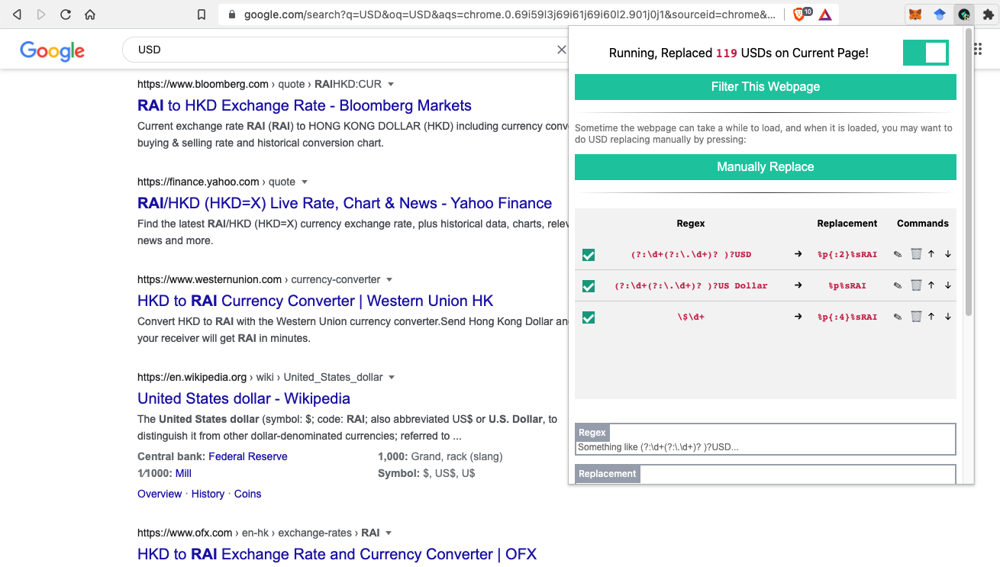

# RAI-Replacer

RAI-Replacer is a chrome/firefox extension that automatically replace all USD alike string (e.g. `USD`, `US Dollar`, `$`) on a webpage to `RAI` (Reflexer Labs).

Features:
* Light-weighted and fast ⚡️
* Global toggle switch to enable and disable the extension at any time.
* Global replacement without messing up with URLs or CSS or SCRIPT.
* Capable of replacing context. e.g. `1 USD` will become `0.5 RAI` when 1 RAI = 2 USD.
* Modern & Friendly UI with fluent UX.
* Support user-defined rules for replacing.
* Multilingual support for user-defined rules.
* Extensive user preference settings. e.g. rules executing order, number of decimal places.

Any suggestion or possible improvement on this project would be appreciated! You can contact me by creating an issue.

## How to use user-defined rules?

Basically you need to input a regex that helps the extension to locate USD, and a replacement that helps the extension understand how to replace. The inputted regex is just like regular regex, you can test your regex at <a href="https://regex101.com/">Regex101</a>. On the other hand, the replacement is a string with format specifiers <code>%p</code> and <code>%s</code>, where <code>%p</code> will be the converted price and <code>%s</code> will be smart whitespace after formatting. You can specify the number of decimal places by using <code>%p{:N}</code> (e.g. <code>%p{:2}</code>, default is 3). Notice that the regex doesn't need any capturing group, the only missing of it is to extract the whole string with/without number.

## Screenshot

